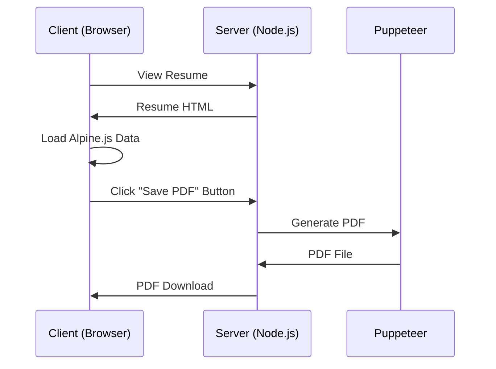

# 📄 PDF Generation Feature Brief: Client-Side PDF Export with Navigation

## 🎯 **Objective**

To create a **client-side PDF generation solution** that allows users to export resumes as single continuous PDF files through an intuitive "Save PDF" button, while maintaining a clean navigation system that doesn't appear in the generated PDFs.

## 🧱 **Problem & Solution**

### **Current Problems**

| Issue | Impact |
|-------|--------|
| Browser PDF printing assumes page breaks | Resume content split across multiple pages |
| Difficult to control page break positioning | Inconsistent PDF output |
| No intuitive web interface for PDF generation | Users must use command line tools |
| Navigation appears in PDF output | Unprofessional PDF appearance |

### **Solution Goals**

| Goal | Description |
|------|-------------|
| Single-page PDF | Generate PDF without automatic page breaks |
| Client-side trigger | "Save PDF" button integrated into resume interface |
| Navigation component | Reusable navigation bar for dashboard and resume pages |
| PDF exclusion | Navigation does not appear in generated PDFs |
| Full content preservation | Maintain all dynamic content and styling |
| Programmatic control | Server-side Puppeteer generation for consistent results |

## ⚙️ **Technical Design**

### **Technology Stack**

| Technology | Purpose |
|------------|---------|
| Puppeteer | Headless Chrome automation for reliable HTML-to-PDF conversion |
| Express.js | Lightweight server for handling PDF generation requests |
| TypeScript | Type safety and enhanced developer experience |
| OpenAPI | API specification and endpoint generation for type safety |
| Alpine.js | Dynamic content loading and state management |
| AJAX | Client-server communication for PDF generation triggers |

### **Architecture Overview**



### **File Structure Changes**

```
resume/
├── components/
│   └── nav.html (new - navigation component)
├── server/
│   ├── server.js (new - Express server)
│   └── pdf-generator.js (new - Puppeteer logic)
├── resume.html (modified - add nav and PDF button)
├── dashboard/
│   └── index.html (modified - add nav)
└── package.json (add express and puppeteer dependencies)
```

## 📋 **Requirements**

### **Core Features**

1. **Navigation Component**
   - Reusable HTML component for navigation
   - Links between dashboard and resume pages
   - Uses dashboard styling for management layer consistency
   - Easy integration into multiple pages

2. **Save PDF Button**
   - Appears only on resume.html pages
   - Loading state during PDF generation
   - Success/error feedback to user
   - Triggers server-side PDF generation

3. **Single-page PDF generation**
   - No automatic page breaks
   - Full content preservation
   - Dynamic content support (wait for Alpine.js)
   - Consistent output regardless of browser

4. **PDF Exclusion Logic**
   - Navigation hidden in PDF output
   - Clean, professional PDF appearance
   - CSS media queries for print exclusion

## 🖥️ **Backend Server Requirements**

### **Server Architecture**

| Component | Requirement |
|-----------|-------------|
| **Express.js Server** | Lightweight HTTP server with middleware support and TypeScript |
| **TypeScript Configuration** | Type-safe development with proper type definitions |
| **OpenAPI Specification** | Define API endpoints, request/response schemas, and documentation |
| **Endpoint Generation** | Auto-generate Express routes from OpenAPI spec with validation |
| **PDF Generation Service** | Puppeteer-based PDF generation with configurable options |
| **Error Handling** | Comprehensive error handling with meaningful HTTP status codes |
| **Request Validation** | Validate all incoming requests against OpenAPI schemas |

### **API Endpoints**

| Endpoint | Method | Purpose | Request Body | Response |
|----------|--------|---------|--------------|----------|
| `/api/generate-pdf` | POST | Generate PDF for current resume | `{ resumeType: string, options?: PDFOptions }` | `{ success: boolean, pdfUrl?: string, error?: string }` |
| `/api/resume-types` | GET | List available resume types | None | `{ types: string[] }` |
| `/api/health` | GET | Server health check | None | `{ status: string, timestamp: string }` |

### **PDF Generation Service**

| Requirement | Specification |
|-------------|---------------|
| **Puppeteer Integration** | Headless Chrome automation for reliable HTML-to-PDF conversion |
| **Dynamic Content Waiting** | Wait for Alpine.js data loading before PDF generation |
| **Single-page Output** | Configure PDF settings to prevent automatic page breaks |
| **Content Preservation** | Maintain all styling, colors, and dynamic content |
| **Navigation Exclusion** | Ensure navigation components are hidden in PDF output |
| **Performance** | PDF generation completes within 30 seconds |
| **Error Handling** | Graceful failure with detailed error messages |
| **File Size Optimization** | Optimize PDF size without quality loss |

### **OpenAPI Specification**

```yaml
openapi: 3.0.0
info:
  title: Resume PDF Generation API
  version: 1.0.0
  description: API for generating PDF resumes with navigation exclusion

paths:
  /api/generate-pdf:
    post:
      summary: Generate PDF for specified resume type
      requestBody:
        required: true
        content:
          application/json:
            schema:
              type: object
              properties:
                resumeType:
                  type: string
                  enum: [staff_platform_engineer, eng_mgr, ai_lead]
                options:
                  $ref: '#/components/schemas/PDFOptions'
      responses:
        '200':
          description: PDF generated successfully
          content:
            application/json:
              schema:
                type: object
                properties:
                  success:
                    type: boolean
                  pdfUrl:
                    type: string
        '400':
          description: Invalid request parameters
        '500':
          description: PDF generation failed

components:
  schemas:
    PDFOptions:
      type: object
      properties:
        width:
          type: string
          default: "8.5in"
          description: "Width of the PDF page"
        height:
          type: string
          default: "auto"
          description: "Height determined by content length"
        printBackground:
          type: boolean
          default: true
          description: "Include background colors and images"
        margin:
          type: object
          properties:
            top: { type: string, default: "0.25in" }
            right: { type: string, default: "0.25in" }
            bottom: { type: string, default: "0.25in" }
            left: { type: string, default: "0.25in" }
        preferCSSPageSize:
          type: boolean
          default: false
          description: "Disable page-based formatting for continuous output"
        pageRanges:
          type: string
          default: "1"
          description: "Ensure single page output"
        scale:
          type: number
          default: 1.0
          description: "Scale factor for content"
```

### **Local Development Setup**

| Component | Requirement |
|-----------|-------------|
| **Development Server** | Express.js server with hot reload for development |
| **Port Configuration** | Default port 3000 with environment variable override |
| **Static File Serving** | Serve resume.html, dashboard, and static assets |
| **CORS Configuration** | Enable CORS for local development with frontend |
| **Environment Variables** | Support for .env file with development settings |
| **Hot Reload** | Nodemon for automatic server restart on file changes |

### **Development Commands**

```bash
# Install dependencies
npm install express puppeteer cors dotenv nodemon typescript @types/node @types/express swagger-jsdoc swagger-ui-express

# Start development server
npm run dev

# Start production server
npm start

# Run tests
npm test

# Type checking
npm run type-check

# Build for production
npm run build

# Generate OpenAPI docs
npm run docs:generate

# Serve API documentation
npm run docs:serve
```

### **Development Configuration**

```typescript
// server/config/development.ts
interface DevelopmentConfig {
  port: number;
  cors: {
    origin: string[];
    credentials: boolean;
  };
  puppeteer: {
    headless: boolean;
    args: string[];
  };
}

const config: DevelopmentConfig = {
  port: parseInt(process.env.PORT || '3000'),
  cors: {
    origin: ['http://localhost:3000', 'http://127.0.0.1:3000'],
    credentials: true
  },
  puppeteer: {
    headless: true,
    args: ['--no-sandbox', '--disable-setuid-sandbox']
  }
};

export default config;
```

### **File Structure for Development**

```
resume/
├── server/
│   ├── src/
│   │   ├── server.ts (main server file)
│   │   ├── config/
│   │   │   ├── development.ts
│   │   │   └── production.ts
│   │   ├── routes/
│   │   │   ├── pdf.ts (PDF generation endpoints)
│   │   │   └── health.ts (health check endpoints)
│   │   ├── services/
│   │   │   └── pdf-generator.ts (Puppeteer service)
│   │   ├── middleware/
│   │   │   └── validation.ts (request validation)
│   │   ├── types/
│   │   │   └── index.ts (shared type definitions)
│   │   └── docs/
│   │       └── swagger.ts (OpenAPI configuration)
│   ├── dist/ (compiled JavaScript)
│   └── tsconfig.json (TypeScript configuration)
├── package.json (add dev scripts)
└── .env (development environment variables)
```

### **OpenAPI Auto-Generation Workflow**

#### **Development Process**

1. **Write JSDoc Comments**: Add OpenAPI annotations to Express routes
2. **Auto-Generate Spec**: Swagger-jsdoc scans comments and generates OpenAPI spec
3. **Serve Interactive Docs**: Swagger UI serves live API documentation
4. **Validate Requests**: Middleware validates incoming requests against spec
5. **Type Safety**: TypeScript interfaces generated from OpenAPI spec

#### **Example Route with OpenAPI Annotations**

```typescript
/**
 * @swagger
 * /api/generate-pdf:
 *   post:
 *     summary: Generate PDF for specified resume type
 *     tags: [PDF]
 *     requestBody:
 *       required: true
 *       content:
 *         application/json:
 *           schema:
 *             type: object
 *             properties:
 *               resumeType:
 *                 type: string
 *                 enum: [staff_platform_engineer, eng_mgr, ai_lead]
 *               options:
 *                 $ref: '#/components/schemas/PDFOptions'
 *     responses:
 *       200:
 *         description: PDF generated successfully
 *         content:
 *           application/json:
 *             schema:
 *               type: object
 *               properties:
 *                 success:
 *                   type: boolean
 *                 pdfUrl:
 *                   type: string
 */
app.post('/api/generate-pdf', async (req, res) => {
  // Route implementation
});
```

#### **Development Workflow**

| Step | Action | Result |
|------|--------|--------|
| 1 | Write route with JSDoc | OpenAPI spec auto-generated |
| 2 | Start dev server | Interactive docs available at `/api-docs` |
| 3 | Test API via Swagger UI | Real-time API testing |
| 4 | Update route comments | Docs automatically updated |
| 5 | Deploy to production | Same validation and docs |

#### **Benefits**

- **Single Source of Truth**: API spec lives with the code
- **Auto-Updated Docs**: Changes to routes automatically update documentation
- **Request Validation**: Incoming requests validated against spec
- **Interactive Testing**: Swagger UI provides built-in API testing
- **Type Safety**: TypeScript interfaces generated from OpenAPI spec

### **Error Handling Strategy**

| Error Type | HTTP Status | Response Format |
|------------|-------------|-----------------|
| Validation Error | 400 | `{ error: "Validation failed", details: [...] }` |
| Resume Type Not Found | 404 | `{ error: "Resume type not found" }` |
| PDF Generation Failed | 500 | `{ error: "PDF generation failed", details: "..." }` |
| Server Error | 500 | `{ error: "Internal server error" }` |

## 🔧 **Configuration**

### **PDF Settings**

```javascript
const pdfOptions = {
  // Custom dimensions to accommodate full resume length without page breaks
  width: '8.5in',
  height: '100in',
  printBackground: true,
  margin: {
    top: '0.25in',
    right: '0.25in',
    bottom: '0.25in',
    left: '0.25in'
  },
  // Disable page-based formatting
  preferCSSPageSize: false,
  displayHeaderFooter: false,
  // Ensure single page output
  pageRanges: '1',
  // Scale to fit content
  scale: 1.0
};
```

### **Navigation Configuration**

```html
<!-- components/nav.html -->
<nav class="no-print">
  <a href="/dashboard">Dashboard</a>
  <a href="/resume?type=staff_platform_engineer">Staff Engineer</a>
  <a href="/resume?type=eng_mgr">Engineering Manager</a>
  <a href="/resume?type=ai_lead">AI Lead</a>
</nav>
```

### **PDF Exclusion CSS**

```css
@media print {
  .no-print {
    display: none !important;
  }
}
```

## 🚀 **Implementation**

### **Server Endpoints**

| Endpoint | Method | Purpose |
|----------|--------|---------|
| `/` | GET | Serve static files |
| `/dashboard` | GET | Dashboard page |
| `/resume` | GET | Resume page with type parameter |
| `/generate-pdf` | POST | Generate PDF for current resume type |

### **User Flow**

1. **Dashboard**: User sees navigation with resume type options
2. **Resume View**: User clicks on resume type, navigates to resume.html
3. **PDF Generation**: User clicks "Save PDF" button
4. **Progress**: Loading indicator shows during generation
5. **Download**: PDF automatically downloads when complete

## 🧪 **Implementation Plan**

### **Phase 1: Navigation Component**

| Step | Task | Description | Status |
|------|------|-------------|--------|
| 1 | Create Navigation Component | Build reusable HTML navigation component with links to dashboard and resume types | ✅ **DONE** |
| 2 | Integrate Navigation | Add navigation to dashboard and resume pages using dashboard styling | ✅ **DONE** |
| 3 | Implement PDF Exclusion | Add CSS media queries to hide navigation in PDF output | ✅ **DONE** |
| 4 | Style Consistency | Ensure navigation uses dashboard styling for management layer consistency | ✅ **DONE** |

### **Phase 2: Save PDF Button**

| Step | Task | Description | Status |
|------|------|-------------|--------|
| 5 | Add PDF Button | Integrate "Save PDF" button into navigation bar (only on resume pages) with proper positioning | ✅ **DONE** |
| 6 | Implement Loading States | Add loading indicator and disable button during PDF generation | ✅ **DONE** |
| 7 | Add Error Handling | Implement error states and user feedback for failed PDF generation | ✅ **DONE** |
| 8 | Style Button | Match button design to dashboard styling for management layer consistency | ✅ **DONE** |

### **Phase 3: Backend Server**

| Step | Task | Description | Status |
|------|------|-------------|--------|
| 9 | Set Up Express Server | Create Express.js server with TypeScript, basic middleware and routing | ✅ **DONE** |
| 10 | Create OpenAPI Spec | Define API endpoints with JSDoc annotations for auto-generation | ✅ **DONE** |
| 11 | Implement Validation | Add request validation middleware using OpenAPI specifications | ✅ **DONE** |
| 12 | Create PDF Service | Build Puppeteer-based PDF generation service with configurable options | ✅ **DONE** |
| 13 | Add Error Handling | Implement comprehensive error handling with proper HTTP status codes | ✅ **DONE** |
| 14 | Add Health Check | Create health check endpoint for server monitoring | ✅ **DONE** |
| 15 | Configure PDF Settings | Set up PDF generation options for single-page, continuous output with auto-height and no page breaks | ✅ **DONE** |

### **Phase 4: PDF Generation Logic**

| Step | Task | Description | Status |
|------|------|-------------|--------|
| 16 | Implement Content Waiting | Add logic to wait for Alpine.js dynamic content to load before PDF generation | TODO |
| 17 | Preserve Content & Styling | Ensure all colors, fonts, and layout are preserved in PDF output | TODO |
| 18 | Configure Navigation Exclusion | Implement CSS rules to exclude navigation from PDF while preserving resume content | TODO |
| 19 | Add Cross-Platform Support | Ensure PDF generation works on macOS, Windows, and Linux | TODO |
| 20 | Optimize File Size | Implement PDF compression and optimization without quality loss | TODO |
| 21 | Add Performance Monitoring | Track PDF generation time and implement performance alerts | TODO |
| 22 | Configure Single-Page Output | Implement PDF settings for continuous, unbroken output with auto-height and no page breaks | TODO |

### **Phase 5: Integration & Testing**

| Step | Task | Description | Status |
|------|------|-------------|--------|
| 23 | Connect Frontend to Backend | Implement AJAX calls from frontend to backend PDF generation endpoint with proper error handling | TODO |
| 24 | Test All Resume Types | Verify PDF generation works for staff_platform_engineer, eng_mgr, and ai_lead | TODO |
| 25 | Verify Navigation Exclusion | Confirm navigation is properly hidden in generated PDFs | TODO |
| 26 | Performance Optimization | Ensure PDF generation completes within 30 seconds for all resume types | TODO |

### **Phase 6: Polish & Deploy**

| Step | Task | Description | Status |
|------|------|-------------|--------|
| 27 | Final UX Refinements | Polish user experience, add success messages, and improve error handling | TODO |
| 28 | Server Deployment | Configure production server deployment with TypeScript compilation and proper environment setup | TODO |
| 29 | Documentation | Create user and developer documentation for the PDF generation feature | TODO |
| 30 | Cross-Platform Testing | Test the complete system on different operating systems and browsers | TODO |
