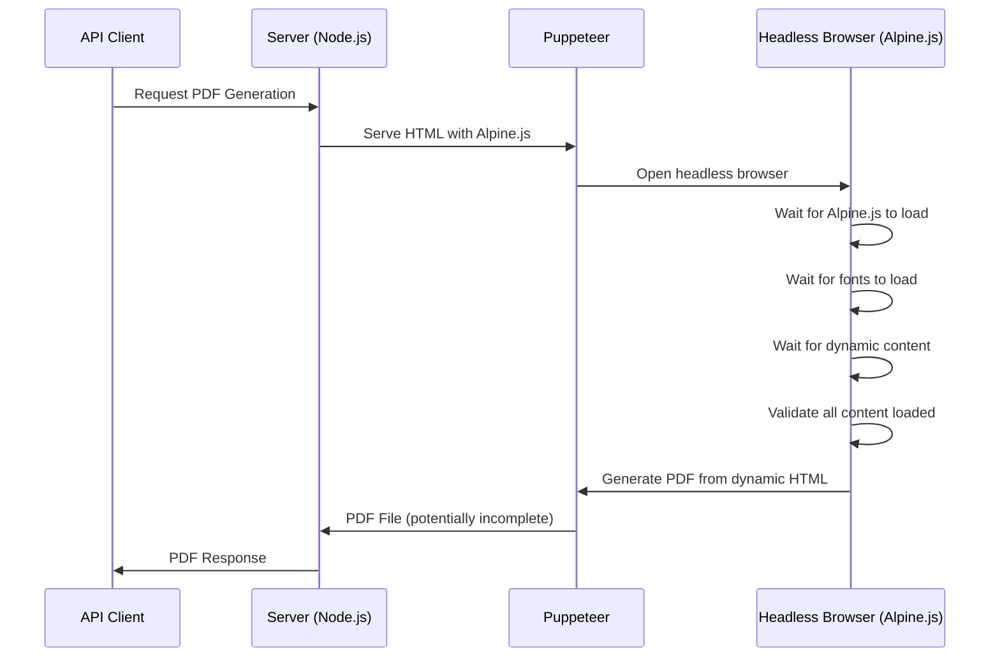
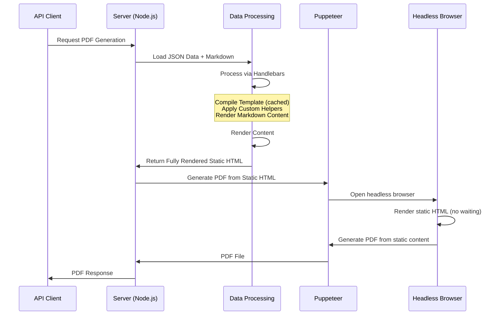

# 📸 PDF Snapshot Approach Brief: Deterministic PDF Generation

## 🎯 **Objective**

To implement a **deterministic PDF generation approach** using **Server-Side Rendering (SSR)** that eliminates Alpine.js timing issues, race conditions, and complex validation logic by rendering fully static HTML/CSS before PDF generation.

## 🧱 **Problem & Solution**

### **Current Problems**

| Issue | Impact |
|-------|--------|
| Complex waiting logic for Alpine.js, fonts, dynamic content | Unreliable PDF generation |
| Race conditions between validation and PDF generation | Inconsistent output |
| Emoji rendering detection and fallback logic | Overly complex font handling |
| Multiple wait functions that can fail | Fragile PDF generation process |
| Timing-dependent content rendering | Non-deterministic results |
| Alpine.js dependency for PDF generation | Unnecessary complexity |

### **Solution Goals**

| Goal | Description |
|------|-------------|
| Deterministic generation | Same input = same output every time |
| Simplified logic | Remove complex waiting/validation |
| Reliable rendering | Server-side HTML generation |
| Faster generation | No need to wait for dynamic content |
| Better maintainability | Clear separation of concerns |
| Server as authoritative source | Single source of truth for rendered content |
| **API-first architecture** | **No browser dependency for PDF generation** |
| **Headless operation** | **PDF generation works without client interaction** |

## ⚙️ **Technical Design**

### **Current vs. Proposed Architecture**

#### **Current Architecture (Problematic)**



#### **Proposed Architecture (SSR Solution with Handlebars)**



### **Implementation Strategy**

#### **Phase 1: Handlebars Template Engine Setup**
- Install and configure Handlebars template engine
- Create `HandlebarsTemplateEngine` class with custom helpers
- Implement template compilation caching for performance
- Set up markdown rendering via Handlebars helpers
- Load all JSON data and markdown files server-side
- Generate fully static HTML for API and PDF generation

#### **Phase 2: Template Migration from Alpine.js**
- Remove Alpine.js dependency from PDF generation process
- Keep Alpine.js for client-side interactivity only
- Convert Alpine.js templates to Handlebars syntax
- Implement server-side template processing with Handlebars
- Enable headless PDF generation via API

#### **Phase 3: Optimization & Caching**
- Compress rendered HTML
- Cache compiled Handlebars templates
- Optimize font handling
- Improve performance with template compilation caching

## 📋 **Requirements**

### **Core Features**

1. **Server-Side Resume Renderer**
   - Load all resume data server-side (JSON + markdown)
   - Render complete HTML without Alpine.js
   - Generate deterministic page representation
   - Handle all dynamic content server-side

2. **Template Processing Engine**
   - Process HTML templates server-side
   - Replace Alpine.js directives with static content
   - Handle conditional rendering server-side
   - Maintain identical visual output

3. **New Resume Template System**
   - Create `resumes/` directory for template organization
   - Build `resumes/default.html` from scratch with clean, modern design
   - Integrate Tailwind CSS with existing shared styles
   - Remove dependency on root-level `resume.html`
   - Support multiple template variants in `resumes/` directory
   - Ensure templates work with server-side rendering

4. **Deterministic Font Handling**
   - Pre-load required fonts in Puppeteer
   - Use consistent font fallbacks
   - Eliminate emoji detection logic
   - Ensure consistent text rendering


### **Technical Implementation**

#### **Template Engine Selection: Handlebars**

**Rationale for Handlebars:**
- **Ecosystem Maturity**: 2.5M+ weekly downloads, 17.5k+ GitHub stars
- **TypeScript Support**: Excellent native TypeScript integration
- **Performance**: Fast compilation with caching capabilities
- **Resume-Specific Features**: Built-in helpers for loops, conditionals, and custom helpers
- **Helm Analogy**: Like Helm's templating system for Kubernetes manifests
- **Learning Curve**: Simple syntax, familiar to most developers
- **Ecosystem**: Extensive helper libraries and community support

#### **Handlebars Template Engine Architecture**
```typescript
import Handlebars from 'handlebars';
import { marked } from 'marked';

interface ServerRenderedResume {
  html: string;                    // Fully rendered HTML
  css: string;                     // Inline CSS for PDF
  data: ResumeData;                // Original data for debugging
  metadata: RenderMetadata;        // Render timing and info
}

class HandlebarsTemplateEngine {
  private compiledTemplates: Map<string, HandlebarsTemplateDelegate> = new Map();

  constructor() {
    this.registerHelpers();
  }

  private registerHelpers() {
    // Markdown rendering helper
    Handlebars.registerHelper('markdown', function(content) {
      return new Handlebars.SafeString(marked.parse(content));
    });

    // Conditional rendering helper
    Handlebars.registerHelper('ifHas', function(property, options) {
      return this[property] && this[property].length > 0
        ? options.fn(this)
        : options.inverse(this);
    });

    // Date formatting helper
    Handlebars.registerHelper('formatDate', function(date) {
      return new Date(date).toLocaleDateString();
    });
  }

  async renderTemplate(templateName: string, data: ResumeData): Promise<string> {
    const compiledTemplate = await this.getCompiledTemplate(templateName);
    return compiledTemplate(data);
  }

  private async getCompiledTemplate(templateName: string): Promise<HandlebarsTemplateDelegate> {
    if (this.compiledTemplates.has(templateName)) {
      return this.compiledTemplates.get(templateName)!;
    }

    const templatePath = path.join(process.cwd(), 'resumes', `${templateName}.html`);
    const template = await fs.promises.readFile(templatePath, 'utf-8');
    const compiledTemplate = Handlebars.compile(template);

    this.compiledTemplates.set(templateName, compiledTemplate);
    return compiledTemplate;
  }
}

class ResumeRenderer {
  private templateEngine: HandlebarsTemplateEngine;

  constructor() {
    this.templateEngine = new HandlebarsTemplateEngine();
  }

  async renderResume(resumeType: string, templateFlavor: string = 'default'): Promise<ServerRenderedResume> {
    // 1. Load all data server-side
    const header = await this.loadHeader();
    const styling = await this.loadStyling();
    const resumeData = await this.loadResumeData(resumeType);
    const markdownContent = await this.loadAllMarkdown(resumeType);

    // 2. Process markdown content
    const processedData = await this.processMarkdownContent(resumeData, markdownContent);

    // 3. Combine data for template
    const templateData = {
      header,
      styling,
      ...processedData
    };

    // 4. Render template using Handlebars
    const html = await this.templateEngine.renderTemplate(templateFlavor, templateData);

    return {
      html,
      css: await this.getTemplateCSS(templateFlavor),
      data: templateData,
      metadata: {
        template: templateFlavor,
        resumeType,
        renderTime: Date.now()
      }
    };
  }
}
```

#### **Template Processing with Handlebars**
```handlebars
<!-- Handlebars template syntax -->
<!-- Before (Alpine.js): <div x-text="data.header.name"></div> -->
<!-- After (Handlebars): <div>{{header.name}}</div> -->

<!-- Before (Alpine.js): <template x-for="job in data.main.experience.jobs"> -->
<!-- After (Handlebars): {{#each main.experience.jobs}} -->

<!-- Before (Alpine.js): <div x-html="summaryContent"></div> -->
<!-- After (Handlebars): <div>{{{markdown summary.content}}}</div> -->
```

#### **Server-Side Processing**
1. Load all JSON data and markdown files
2. Process Handlebars templates server-side
3. Replace Alpine.js directives with Handlebars syntax
4. Generate fully rendered HTML
5. Serve to API clients and use for PDF generation

#### **New Template Requirements**

**Directory Structure:**
```
resumes/
├── default.html          # Handlebars template with clean, modern design
├── modern.html           # Contemporary Handlebars template variant
├── classic.html          # Traditional Handlebars template variant
├── compact.html          # Single-page focused Handlebars template
└── styles/
    ├── default.css       # Template-specific styles
    ├── modern.css        # Modern template styles
    ├── classic.css       # Classic template styles
    └── compact.css       # Compact template styles
```

**Handlebars Template Design Requirements:**
- **Clean, Modern Design**: Start fresh without prototype complexity
- **Handlebars Syntax**: Use `{{variable}}` for simple data binding
- **Handlebars Helpers**: Use `{{{markdown content}}}` for markdown rendering
- **Conditional Logic**: Use `{{#if condition}}` and `{{#unless condition}}`
- **Loop Rendering**: Use `{{#each array}}` for dynamic content
- **Tailwind Integration**: Use Tailwind CSS for styling consistency
- **Shared Styles**: Leverage existing `styles/shared.css` for common elements
- **Server-Side Compatible**: No Alpine.js dependencies for rendering
- **PDF-Ready**: Optimized for PDF generation without navigation elements
- **Responsive**: Works across different screen sizes
- **Accessible**: Follow accessibility best practices

**Migration Strategy:**
- Remove dependency on root `resume.html`
- Create modular template system in `resumes/` directory
- Support multiple template variants for different use cases
- Ensure backward compatibility with existing data structure

#### **Handlebars Template Examples**

**Default Template (`resumes/default.html`):**
```handlebars
<!DOCTYPE html>
<html lang="en">
<head>
  <meta charset="UTF-8">
  <meta name="viewport" content="width=device-width, initial-scale=1.0">
  <title>{{header.name}} - Resume</title>
  <script src="https://cdn.tailwindcss.com"></script>
  <link rel="stylesheet" href="styles/shared.css">
  <link rel="stylesheet" href="styles/default.css">
</head>
<body class="bg-gray-50 font-sans text-gray-900">
  <div class="resume-content flex mx-auto bg-white shadow-lg relative max-w-5xl">
    <!-- Dark top trim -->
    <div class="absolute top-0 left-0 w-full h-4 z-10" style="background-color: {{styling.colors.accent}}"></div>

    <!-- Sidebar -->
    <div class="text-white relative flex flex-col w-1/3" style="background-color: {{styling.colors.primary}}">
      <div class="pt-6 px-6 pb-1.5">
        <div class="flex justify-center mb-9">
          
        </div>
      </div>

      <div class="flex-1 px-6">
        <h2 class="text-2xl font-bold">{{sidebar.summary.title}}</h2>
        <hr class="page-break-line">
        <div class="text-sm mt-2 markdown-content">{{{markdown sidebar.summary.content}}}</div>

        {{#ifHas sidebar.skills.categories}}
        <h2 class="text-2xl font-bold">{{sidebar.skills.title}}</h2>
        <hr class="page-break-line">
        <div class="grid grid-cols-1 gap-y-1 text-sm mt-2">
          {{#each sidebar.skills.categories}}
          <div>
            <div class="markdown-content">{{{markdown content}}}</div>
          </div>
          {{/each}}
        </div>
        {{/ifHas}}
      </div>

      <div class="pb-6"></div>
    </div>

    <!-- Main Content -->
    <div class="flex flex-col w-2/3">
      <div class="pt-6 px-10">
        <h1 class="text-3xl font-bold" style="color: {{styling.colors.textPrimary}}">{{header.name}}</h1>
        <p class="text-xl font-semibold italic" style="color: {{styling.colors.textAccent}}">{{header.title}}</p>

        <div class="text-sm mt-2" style="color: {{styling.colors.textSecondary}}">
          <div class="flex gap-12">
            <div class="space-y-2">
              <div>📧 <span>{{header.email}}</span></div>
              <div>📍 <span>{{header.location}}</span></div>
            </div>
            <div class="space-y-2">
              <div>🔗 <a href="{{header.linkedin}}" style="color: {{styling.colors.textAccent}}" class="underline">LinkedIn</a></div>
              <div>💻 <a href="{{header.github}}" style="color: {{styling.colors.textAccent}}" class="underline">GitHub</a></div>
            </div>
            <div class="space-y-2">
              <div>🌐 <a href="{{header.website}}" style="color: {{styling.colors.textAccent}}" class="underline">{{header.website}}</a></div>
              {{#if header.phone}}
              <div>📞 <span>{{header.phone}}</span></div>
              {{/if}}
            </div>
          </div>
        </div>
      </div>

      <div class="flex-1 px-10 pt-8">
        <h2 class="text-2xl font-bold" style="color: {{styling.colors.textPrimary}}">{{main.experience.title}}</h2>
        <hr class="page-break-line">

        {{#each main.experience.jobs}}
        <div class="{{#if @first}}mt-4{{else}}mt-6{{/if}}">
          <div class="flex justify-between">
            <div>
              <h3 class="font-semibold text-md">{{title}}</h3>
              <p class="text-base font-medium" style="color: {{../styling.colors.textAccent}}">{{company}}</p>
            </div>
            <p class="text-sm">{{formatDate startDate}} – {{formatDate endDate}}</p>
          </div>
          <div class="text-sm mt-1 markdown-content">{{{markdown content}}}</div>
        </div>
        {{/each}}
      </div>
    </div>
  </div>
</body>
</html>
```

## 🖥️ **Backend Requirements**

### **API Changes**

| Endpoint | Method | Purpose | Request Body | Response |
|----------|--------|---------|--------------|----------|
| `/api/render-resume` | GET | Get server-rendered resume | `{ resumeType: string }` | `{ html: string, css: string, data: object }` |
| `/api/generate-pdf` | POST | Generate PDF from server-rendered HTML | `{ resumeType: string, options?: PDFOptions }` | `{ success: boolean, pdfUrl?: string, error?: string }` |

### **Server-Side Rendering Service**

| Component | Requirement |
|-----------|-------------|
| **Data Loader** | Load JSON and markdown files server-side |
| **Handlebars Template Engine** | Process Handlebars templates with custom helpers |
| **Markdown Renderer** | Render markdown content via Handlebars helpers |
| **HTML Generator** | Generate complete HTML structure using Handlebars |
| **CSS Inliner** | Inline CSS for PDF generation |

### **Performance Considerations**

| Aspect | Target |
|---------|--------|
| **Render Time** | < 2 seconds |
| **Memory Usage** | < 50MB per request |
| **Concurrent Requests** | Support 10+ simultaneous |
| **Cache Hit Rate** | > 80% for repeated requests |

## 📊 **Benefits vs Current Approach**

| Aspect | Current Approach | SSR Approach |
|--------|------------------|--------------|
| **Reliability** | Timing-dependent | Deterministic |
| **Complexity** | High (multiple waits) | Low (single render) |
| **Performance** | Variable (wait times) | Consistent |
| **Maintainability** | Complex validation | Simple processing |
| **Debugging** | Hard (timing issues) | Easy (static data) |
| **Font Handling** | Complex (emoji detection) | Simple (pre-loaded) |
| **Alpine.js Dependency** | Required for PDF | Optional (client-only) |
| **Browser Dependency** | Required for PDF | **Eliminated** |
| **API Integration** | Complex (browser automation) | **Simple HTTP requests** |

## 🚀 **Implementation Plan**

### **Phase 1: Server-Side Renderer** ✅ **COMPLETED**

| Step | Task | Description | Status |
|------|------|-------------|--------|
| 1 | Install Handlebars Dependencies | Add `handlebars` and `@types/handlebars` to package.json | ✅ **DONE** |
| 2 | Create Handlebars Template Engine | Build `HandlebarsTemplateEngine` class with helper registration | ✅ **DONE** |
| 3 | Implement Data Loading | Create service to load all resume data server-side (JSON + markdown) | ✅ **DONE** |
| 4 | Test Simple Pages | Verify Handlebars rendering works with basic resume pages | ✅ **DONE** |

### **Phase 2: Template Migration** 🔄 **IN PROGRESS**

| Step | Task | Description | Status |
|------|------|-------------|--------|
| 5 | Create Resumes Directory | Create `resumes/` directory structure for template organization | ✅ **DONE** |
| 6 | Build Default Handlebars Template | Create `resumes/default.html` with Handlebars syntax | ✅ **DONE** |
| 7 | Implement Tailwind Integration | Integrate Tailwind CSS with existing shared styles for consistent theming | ✅ **DONE** |
| 8 | Convert Alpine.js to Handlebars | Replace Alpine.js directives with Handlebars syntax | ✅ **DONE** (isolated approach) |
| 9 | Register Custom Helpers | Implement markdown, conditional, and date formatting helpers | ✅ **DONE** |
| 10 | Process Dynamic Content | Build system to handle dynamic content processing with Handlebars | ✅ **DONE** |
| 11 | Test Complex Pages | Verify all resume types render correctly with Handlebars logic | ✅ **DONE** |

### **Phase 3: PDF Integration** ⏳ **PENDING**

| Step | Task | Description | Status |
|------|------|-------------|--------|
| 12 | Update PDF Generator | Modify PDF generator to use server-rendered HTML instead of client-side | ⏳ **PENDING** |
| 13 | Remove Alpine.js Dependency | Eliminate Alpine.js requirement from PDF generation process | ⏳ **PENDING** |
| 14 | Implement CSS Inlining | Add CSS inlining service for PDF generation | ⏳ **PENDING** |
| 15 | Test PDF Consistency | Verify deterministic PDF generation with consistent output | ⏳ **PENDING** |

---

## 📈 **Current Progress Summary**

### **✅ Phase 1: COMPLETED**
- **Handlebars Template Engine**: Fully implemented with custom helpers
- **Resume Renderer Service**: Server-side data loading and processing
- **API Endpoints**: `/api/render-resume`, `/api/available-resume-types`, `/api/available-templates`
- **Template System**: `resumes/default.html` with Handlebars syntax
- **CSS Integration**: Template-specific styles in `resumes/styles/default.css`

### **🔄 Phase 2: IN PROGRESS**
- **Current Focus**: Testing SSR with all resume types
- **Remaining Tasks**:
  - Test `staff_platform_engineer`, `ai_lead`, `eng_mgr` resume types
  - Verify all markdown content renders correctly
  - Optional: Add template variants (modern, classic)

### **⏳ Phase 3: PENDING**
- **PDF Integration**: Update PDF generator to use SSR
- **Alpine.js Removal**: Eliminate client-side dependencies from PDF generation
- **CSS Inlining**: Add CSS inlining for PDF generation

### **🎯 Next Steps**
1. **Test SSR endpoint** with all resume types
2. **Verify template rendering** for complex content
3. **Begin Phase 3** (PDF integration) once Phase 2 is complete
