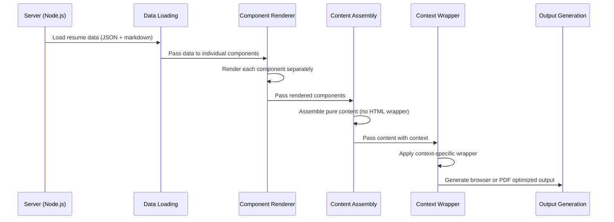

# 📄 Resume Componentization Feature Brief: Unified Content Pipeline

## 🎯 **Objective**

To refactor the current monolithic HTML resume generation system into a **component-based architecture** with a **unified content pipeline** that generates pure content, then applies context-specific wrappers for browser and PDF optimization.

## 🧱 **Current State Analysis**

### **Current Architecture**

The resume system currently uses a **monolithic template approach**:

```
resumes/
├── default.html          # Single monolithic template (95 lines)
└── styles/
    └── default.css       # Template-specific styles (234 lines)
```

**Current HTML Structure:**
- **Single Template**: `resumes/default.html` contains all sections
- **Handlebars Rendering**: Server-side template processing via `UnifiedTemplateEngine`
- **Data Sections**: Experience, Skills, Summary, Header (from `data/` directory)
- **Dual Output**: Browser-optimized (via `/resume` route) and PDF-optimized (via Puppeteer)
- **Inline CSS**: CSS is inlined for PDF generation via `CSSManager`

### **Current PDF Generation Strategy**

The current system uses a sophisticated context-aware rendering approach:

1. **UnifiedTemplateEngine** renders resume with context `{ forPDF: true }`
2. **CSSManager** provides complete CSS with PDF optimizations
3. **PDFGenerator.createCompleteHTML()** wraps content in complete HTML document
4. **Puppeteer** generates PDF from the complete HTML

**Key Components:**
- **Context-Aware Rendering**: Different processing for browser vs PDF
- **CSS Assembly**: PDF-specific optimizations (embedded fonts, icons)
- **Complete HTML Wrapper**: Self-contained HTML for PDF generation

### **Current Problems**

| Issue | Impact |
|-------|--------|
| **Monolithic Template** | Single large HTML file (95 lines) difficult to maintain |
| **Mixed Concerns** | Header, Experience, Skills, Summary all in one template |
| **Limited Reusability** | Cannot reuse individual sections across templates |
| **Testing Complexity** | Hard to test individual components in isolation |
| **Template Duplication** | Similar sections repeated across different templates |
| **Maintenance Overhead** | Changes to one section require editing entire template |
| **Legacy Architecture** | Monolithic approach prevents modern component-based development |

## 🎯 **Proposed Solution: Unified Content Pipeline**

### **Component-Based Architecture**

Transform the monolithic template into **modular components** with a **unified content pipeline**:

```
resumes/
├── default/
│   ├── header.html       # Header component (lines 47-67 from default.html)
│   ├── experience.html   # Experience component (lines 69-85 from default.html)
│   ├── skills.html       # Skills component (lines 25-45 from default.html)
│   ├── summary.html      # Summary component (lines 20-24 from default.html)
│   └── layout.html       # Content layout (no HTML wrapper)
├── modern/
│   ├── header.html       # Modern template header component
│   ├── experience.html   # Modern template experience component
│   ├── skills.html       # Modern template skills component
│   ├── summary.html      # Modern template summary component
│   └── layout.html       # Modern template layout component
├── classic/
│   ├── header.html       # Classic template header component
│   ├── experience.html   # Classic template experience component
│   ├── skills.html       # Classic template skills component
│   ├── summary.html      # Classic template summary component
│   └── layout.html       # Classic template layout component
├── default.html          # Will be removed after component system is complete
└── styles/
    └── default.css       # Template-specific styles (already exists)
```

**Navigation Component** (separate from resume templates):
```
components/
└── navigation/
    └── nav.html          # Navigation component (browser only, not part of resume)
```

### **Component Extraction Mapping**

| Component | Source Lines | Target File | Content Type |
|-----------|-------------|-------------|--------------|
| **Header** | 47-67 | `resumes/default/header.html` | Contact info, name, title |
| **Experience** | 69-85 | `resumes/default/experience.html` | Job history, descriptions |
| **Skills** | 25-45 | `resumes/default/skills.html` | Technical skills, categories |
| **Summary** | 20-24 | `resumes/default/summary.html` | Professional summary |
| **Layout** | 15-18, 47-85 | `resumes/default/layout.html` | Component assembly |
| **Navigation** | N/A | `components/navigation/nav.html` | Dashboard links (browser only) |

### **Unified Content Pipeline**

The system will generate **pure content**, then apply **context-specific wrappers**:

```typescript
interface RenderedContent {
  htmlContent: string;    // Pure resume content (no HTML wrapper)
  cssContent: string;     // Complete CSS (context-aware)
  metadata: {
    template: string;
    resumeType: string;
    context: TemplateContext;
  };
}

interface TemplateContext {
  forPDF: boolean;           // PDF vs browser optimization
  template: string;          // Template name (default, modern, etc.)
  includeFonts: boolean;     // Embed fonts for PDF
  includeIcons: boolean;     // Embed icons for PDF
  includeNavigation: boolean; // Include nav for browser only
}
```

### **Component Responsibilities**

| Component | Purpose | Data Source | Template-Specific |
|-----------|---------|-------------|-------------------|
| **Header** | Contact info, name, title | `data/shared/header.json` | Yes (each template has its own header.html) |
| **Experience** | Job history, descriptions | `data/{type}/experience/` | Yes (each template has its own experience.html) |
| **Skills** | Technical skills, categories | `data/{type}/skills/` | Yes (each template has its own skills.html) |
| **Summary** | Professional summary | `data/{type}/summary/` | Yes (each template has its own summary.html) |
| **Layout** | Content structure (no HTML wrapper) | Template configuration | Yes (each template has its own layout.html) |

### **Context-Aware Wrapper System**

Create wrapper templates for different output types:

```typescript
class ContentWrapper {
  async wrapForBrowser(content: RenderedContent): Promise<string> {
    // Navigation is included only for browser rendering
    const navComponent = await this.loadNavigationComponent();

    return `
<!DOCTYPE html>
<html lang="en">
<head>
  <meta charset="UTF-8">
  <meta name="viewport" content="width=device-width, initial-scale=1.0">
  <title>Resume</title>
  <script src="https://cdn.tailwindcss.com"></script>
  <link rel="stylesheet" href="styles/shared.css">
  <link rel="stylesheet" href="resumes/styles/default.css">
</head>
<body class="bg-gray-50 font-sans text-gray-900">
  ${navComponent}
  ${content.htmlContent}
</body>
</html>`;
  }

  async wrapForPDF(content: RenderedContent): Promise<string> {
    // No navigation in PDF output
    return `
<!DOCTYPE html>
<html lang="en">
<head>
  <meta charset="UTF-8">
  <meta name="viewport" content="width=device-width, initial-scale=1.0">
  <title>Resume</title>
  <style>
    ${content.cssContent}
  </style>
</head>
<body>
  ${content.htmlContent}
</body>
</html>`;
  }
}
```

### **Server-Side Renderer Architecture**



## ⚙️ **Technical Implementation**

### **Component Renderer Service**

```typescript
interface ComponentRenderer {
  renderComponent(
    componentName: string,
    templateName: string,
    data: ResumeData,
    context: TemplateContext
  ): Promise<string>;

  renderContent(
    resumeType: string,
    templateName: string,
    context: TemplateContext
  ): Promise<RenderedContent>;
}

class ResumeComponentRenderer {
  private componentCache: Map<string, HandlebarsTemplateDelegate> = new Map();

  async renderContent(
    resumeType: string,
    templateName: string,
    context: TemplateContext
  ): Promise<RenderedContent> {
    // 1. Load all data
    const data = await this.loadResumeData(resumeType, context);

    // 2. Render individual components
    const components = await this.renderComponents(templateName, data, context);

    // 3. Assemble into pure content (no HTML wrapper)
    const htmlContent = await this.assembleContent(templateName, components, data, context);

    // 4. Get context-aware CSS
    const cssContent = await this.cssManager.getCompleteCSS(context);

    return {
      htmlContent,
      cssContent,
      metadata: {
        template: templateName,
        resumeType,
        context
      }
    };
  }

  private async renderComponents(
    templateName: string,
    data: ResumeData,
    context: TemplateContext
  ): Promise<Map<string, string>> {
    const components = new Map<string, string>();

    // Render each component
    components.set('header', await this.renderComponent('header', templateName, data, context));
    components.set('experience', await this.renderComponent('experience', templateName, data, context));
    components.set('skills', await this.renderComponent('skills', templateName, data, context));
    components.set('summary', await this.renderComponent('summary', templateName, data, context));
    components.set('nav', await this.renderComponent('nav', templateName, data, context));

    return components;
  }
}
```

### **Component Template Examples**

#### **Header Component** (`resumes/default/header.html`)
```handlebars
<div class="pt-6 px-10">
  <h1 class="text-4xl font-semibold mb-2" style="color: {{styling.colors.textPrimary}}">{{header.name}}</h1>
  <p class="text-2xl font-normal mb-3" style="color: {{styling.colors.textAccent}}">{{header.title}}</p>

  <div class="text-sm mt-2" style="color: {{styling.colors.textSecondary}}">
    <div class="flex gap-12">
      <div class="space-y-2">
        <div class="flex items-center">{{{icon "email"}}} <span class="ml-1">{{header.email}}</span></div>
        <div class="flex items-center">{{{icon "location"}}} <span class="ml-1">{{header.location}}</span></div>
      </div>
    </div>
  </div>
</div>
```

#### **Experience Component** (`resumes/default/experience.html`)
```handlebars
<div class="flex-1 px-10 pt-8">
  <h2 class="text-2xl font-bold" style="color: {{styling.colors.textPrimary}}">{{main.experience.title}}</h2>
  <hr class="page-break-line">

  {{#each main.experience.jobs}}
  <div class="{{#if @first}}mt-4{{else}}mt-6{{/if}}">
    <div class="flex justify-between">
      <div>
        <h3 class="font-semibold text-md">{{title}}</h3>
        <p class="text-base font-medium" style="color: {{../styling.colors.textAccent}}">{{company}}</p>
      </div>
      <p class="text-sm">{{startDate}} – {{endDate}}</p>
    </div>
    <div class="text-sm mt-1 markdown-content">{{{markdown content}}}</div>
  </div>
  {{/each}}
</div>
```

#### **Skills Component** (`resumes/default/skills.html`)
```handlebars
<div class="flex-1 px-6">
  {{#if sidebar.skills}}
  <h2 class="text-2xl font-bold">{{sidebar.skills.title}}</h2>
  <hr class="page-break-line">
  <div class="grid grid-cols-1 gap-y-0 text-sm mt-2">
    {{#each sidebar.skills.categories}}
    <div>
      <div class="markdown-content">{{{markdown content}}}</div>
    </div>
    {{/each}}
  </div>
  {{/if}}
</div>
```

#### **Summary Component** (`resumes/default/summary.html`)
```handlebars
<div class="pt-14 px-6">
  <div class="flex justify-center mb-8">
    
  </div>
</div>

<div class="flex-1 px-6">
  <h2 class="text-2xl font-bold">{{sidebar.summary.title}}</h2>
  <hr class="page-break-line">
  <div class="text-sm mt-2 markdown-content">{{{markdown sidebar.summary.content}}}</div>
</div>
```

#### **Layout Component** (`resumes/default/layout.html`)
```handlebars
<!-- Pure content layout (no HTML wrapper) -->
<div class="resume-content flex mx-auto bg-white shadow-lg relative max-w-5xl">
  <!-- Dark top trim -->
  <div class="absolute top-0 left-0 w-full h-4 z-10" style="background-color: {{styling.colors.accent}}"></div>

  <!-- Sidebar -->
  <div class="text-white relative flex flex-col w-1/3" style="background-color: {{styling.colors.primary}}">
    {{{component "summary"}}}
    {{{component "skills"}}}
  </div>

  <!-- Main Content -->
  <div class="flex flex-col w-2/3">
    {{{component "header"}}}
    {{{component "experience"}}}
  </div>
</div>
```

### **Technical Implementation Details**

#### **Component Helper Implementation**
```typescript
// Add to UnifiedTemplateEngine.registerHelpers()
Handlebars.registerHelper('component', async function(componentName: string, options: any) {
  const templateName = this.template || 'default';

  try {
    const componentTemplate = await this.loadComponentTemplate(componentName, templateName);
    const compiledComponent = Handlebars.compile(componentTemplate);
    return new Handlebars.SafeString(compiledComponent(this));
  } catch (error) {
    throw new Error(`Failed to render component '${componentName}' for template '${templateName}': ${error.message}`);
  }
});
```

#### **Component Loading with Early Error Handling**
```typescript
private async loadComponentTemplate(componentName: string, templateName: string = 'default'): Promise<string> {
  // Load template-specific component
  const templateSpecificPath = path.join(process.cwd(), 'resumes', templateName, `${componentName}.html`);
  if (!fs.existsSync(templateSpecificPath)) {
    throw new Error(`Component not found: ${componentName} for template: ${templateName} at path: ${templateSpecificPath}`);
  }

  return await fs.promises.readFile(templateSpecificPath, 'utf-8');
}
```

#### **Enhanced RenderedTemplate Interface**
```typescript
export interface RenderedTemplate {
  html: string;           // Complete HTML document (existing)
  htmlContent: string;    // Pure content without HTML wrapper (new)
  css: string;           // Complete CSS (existing)
  data: any;             // Resume data (existing)
  metadata: {
    template: string;
    resumeType: string;
    renderTime: number;
    context: TemplateContext;
  };
}
```

#### **ContentWrapper Service**
```typescript
export class ContentWrapper {
  async wrapForBrowser(content: RenderedTemplate): Promise<string> {
    // Load navigation component for browser rendering
    const navComponent = await this.loadNavigationComponent();

    return `
<!DOCTYPE html>
<html lang="en">
<head>
  <meta charset="UTF-8">
  <meta name="viewport" content="width=device-width, initial-scale=1.0">
  <title>Resume</title>
  <script src="https://cdn.tailwindcss.com"></script>
  <link rel="stylesheet" href="styles/shared.css">
  <link rel="stylesheet" href="resumes/styles/default.css">
</head>
<body class="bg-gray-50 font-sans text-gray-900">
  ${navComponent}
  ${content.htmlContent}
</body>
</html>`;
  }

  async wrapForPDF(content: RenderedTemplate): Promise<string> {
    return `
<!DOCTYPE html>
<html lang="en">
<head>
  <meta charset="UTF-8">
  <meta name="viewport" content="width=device-width, initial-scale=1.0">
  <title>Resume</title>
  <style>
    ${content.css}
  </style>
</head>
<body>
  ${content.htmlContent}
</body>
</html>`;
  }

  private async loadNavigationComponent(): Promise<string> {
    const navPath = path.join(process.cwd(), 'components', 'navigation', 'nav.html');
    if (!fs.existsSync(navPath)) {
      throw new Error(`Navigation component not found at: ${navPath}`);
    }
    return await fs.promises.readFile(navPath, 'utf-8');
  }
}
```

#### **Component-Based Rendering Method**
```typescript
// Replace existing renderResume() method with new component-based approach
async renderContent(resumeType: string, templateName: string, context: TemplateContext): Promise<RenderedTemplate> {
  // New method for component-based rendering
  const content = await this.renderPureContent(resumeType, templateName, context);
  return {
    ...content,
    html: await this.contentWrapper.wrapForBrowser(content)
  };
}

async renderResume(resumeType: string, templateName: string, context: TemplateContext): Promise<RenderedTemplate> {
  // Updated method using component system
  return await this.renderContent(resumeType, templateName, context);
}
```

### **Integration Points**

#### **Browser Route** (`/resume-ssr`)
```typescript
// Updated route in server/src/routes/render.ts
router.get('/resume-ssr', async (req: Request, res: Response): Promise<void> => {
  const { resumeType, template = 'default' } = req.query;

  // Render the resume using component system
  const renderedResume = await resumeRenderer.renderResume(resumeType, template as string);

  // Send as HTML page
  res.setHeader('Content-Type', 'text/html');
  res.send(renderedResume.html);
});
```

#### **API Route** (`/api/render-resume`)
```typescript
// Updated route in server/src/routes/render.ts
router.get('/render-resume', async (req: Request, res: Response): Promise<void> => {
  const { resumeType, template = 'default' } = req.query;

  // Render the resume using component system
  const renderedResume = await resumeRenderer.renderResume(resumeType, template as string);

  res.json({
    success: true,
    html: renderedResume.html,
    css: renderedResume.css,
    metadata: renderedResume.metadata
  });
});
```

#### **PDF Route** (`/api/generate-pdf`)
```typescript
// Updated route in server/src/routes/pdf.ts
router.post('/generate-pdf', validateResumeType, async (req: Request, res: Response) => {
  const { resumeType, options }: GeneratePDFRequest = req.body;

  // Use updated PDFGenerator with component system
  const result = await pdfGenerator.generatePDF(resumeType, options, req.correlationId);

  if (result.success) {
    const filename = path.basename(result.filePath!);
    const pdfUrl = `/api/download-pdf?file=${encodeURIComponent(filename)}`;

    return res.json({
      success: true,
      pdfUrl,
      generationTime: result.generationTime
    });
  }

  return res.status(500).json({
    success: false,
    error: result.error,
    generationTime: result.generationTime
  });
});
```

### **Component System Migration Strategy**

The implementation replaces the monolithic template system with:

1. **Component-Based Architecture**: All templates use modular components
2. **Unified Content Pipeline**: Pure content generation with context-specific wrappers
3. **Template-Specific Components**: All components must be template-specific, no shared fallbacks
4. **Separate Navigation**: Navigation is handled at wrapper level, not part of resume templates
5. **Context-Aware Rendering**: Browser includes navigation, PDF excludes navigation
6. **Clean Architecture**: Clear separation of concerns between components

## 📋 **Implementation Requirements**

### **Core Features**

1. **Component-Based Architecture**
   - Separate HTML files for each resume section
   - Reusable components across different templates
   - Isolated testing and maintenance
   - Clear separation of concerns

2. **Unified Content Pipeline**
   - Generate pure content (no HTML wrapper)
   - Context-aware CSS assembly
   - Single source of truth for content generation
   - Flexible wrapper system for different outputs

3. **Context-Aware Wrapper System**
   - Browser-optimized wrapper with external resources
   - PDF-optimized wrapper with embedded assets
   - Maintain identical visual output
   - Easy to add new output types

4. **Template Flexibility**
   - Support multiple template variants
   - Template-specific components (no shared components)
   - Early error handling for missing components
   - Easy template creation and modification
   - Navigation handled separately from resume templates

## 🧪 **Implementation Plan**

### **📊 Overall Progress**
- **Phase 1**: ✅ **COMPLETED** (5/5 tasks)
- **Phase 2**: ✅ **COMPLETED** (8/8 tasks)
- **Phase 3**: ✅ **COMPLETED** (5/5 tasks)
- **Phase 4**: 🔄 **READY TO START** (6/6 tasks)
- **Phase 5**: ⏳ **PENDING** (6/6 tasks)

**Total Progress**: 18/30 tasks completed (60.0%)

### **🎯 Current Implementation Status**

**✅ Completed Infrastructure:**
- ContentWrapper service with context-aware HTML wrapping
- Component injection system (`{{component "name"}}`)
- Enhanced UnifiedTemplateEngine with `renderContent()` method
- Updated PDFGenerator to use ContentWrapper
- Component pre-loading system for synchronous Handlebars helpers
- Template discovery system updated for component-based templates

**✅ Completed Component Extraction:**
- Header component extracted and functional
- Experience component extracted and functional
- Skills component extracted and functional
- Summary component extracted and functional
- Layout template with component injection working
- Navigation component for browser rendering
- Component isolation verified and tested

**✅ Completed Layout Assembly:**
- Component loading system with template-specific overrides
- Template-specific component requirements enforced
- CSS assembly updated for component contexts
- Layout assembly testing completed
- Monolithic template successfully removed

**🔄 Ready for Phase 4:**
- Dynamic component loading implementation
- Component caching system
- Performance optimization
- Advanced template features
- Component versioning system
- Template inheritance system

**📋 Next Steps:**
1. Implement dynamic component loading
2. Add component caching for performance
3. Optimize component rendering
4. Add advanced template features
5. Implement component versioning
6. Create template inheritance system

### **Phase 1: Unified Content Pipeline** ✅ **COMPLETED**

| Step | Task | Description | Status |
|------|------|-------------|--------|
| 1 | Enhance RenderedTemplate Interface | Extend existing `RenderedTemplate` to include `htmlContent` (pure content) and `html` (complete document) | ✅ **COMPLETED** |
| 2 | Extract ContentWrapper System | Extract `PDFGenerator.createCompleteHTML()` logic into dedicated `ContentWrapper` service | ✅ **COMPLETED** |
| 3 | Add Component Injection Helper | Implement Handlebars helper for `{{{component "name"}}}` syntax with template override support | ✅ **COMPLETED** |
| 4 | Update UnifiedTemplateEngine | Replace `renderResume()` method with new `renderContent()` method for pure content generation | ✅ **COMPLETED** |
| 5 | Test Component System | Verify new component-based rendering works correctly | ✅ **COMPLETED** |

**Phase 1 Achievements:**
- ✅ Created `ContentWrapper` service with context-aware HTML wrapping
- ✅ Enhanced `RenderedTemplate` interface with `htmlContent` property
- ✅ Added component injection helper `{{component "name"}}`
- ✅ Implemented `loadComponentTemplate()` with template-specific override support
- ✅ Updated `PDFGenerator` to use `ContentWrapper` instead of internal method
- ✅ Created test components (`header.html`, `layout.html`, `nav.html`)
- ✅ Server running successfully with component system working
- ✅ Component injection verified and functional

### **Phase 2: Component Extraction** ✅ **COMPLETED**

| Step | Task | Description | Status |
|------|------|-------------|--------|
| 6 | Extract Header Component | Parse lines 47-67 from `resumes/default.html` into `resumes/default/header.html` | ✅ **COMPLETED** |
| 7 | Extract Experience Component | Parse lines 69-85 from `resumes/default.html` into `resumes/default/experience.html` | ✅ **COMPLETED** |
| 8 | Extract Skills Component | Parse lines 25-45 from `resumes/default.html` into `resumes/default/skills.html` | ✅ **COMPLETED** |
| 9 | Extract Summary Component | Parse lines 20-24 from `resumes/default.html` into `resumes/default/summary.html` | ✅ **COMPLETED** |
| 10 | Create Layout Template | Build `resumes/default/layout.html` with component injection syntax | ✅ **COMPLETED** |
| 11 | Create Navigation Component | Build `components/navigation/nav.html` for browser-only navigation | ✅ **COMPLETED** |
| 12 | Update Template Discovery | Modify `getAvailableTemplates()` to support component-based templates | ✅ **COMPLETED** |
| 13 | Test Component Isolation | Verify each component renders correctly in isolation | ✅ **COMPLETED** |

**Phase 2 Achievements:**
- ✅ Successfully extracted all components from monolithic template
- ✅ Created functional layout template with component injection
- ✅ Implemented component pre-loading system for synchronous Handlebars helpers
- ✅ Updated template discovery to support component-based templates
- ✅ Verified component isolation and assembly working correctly
- ✅ Tested both browser rendering and PDF generation successfully
- ✅ Component system fully functional with proper error handling

### **Phase 3: Layout Assembly** ✅ **COMPLETED**

| Step | Task | Description | Status |
|------|------|-------------|--------|
| 14 | Implement Component Loading | Add `loadComponentTemplate()` method with template-specific override support | ✅ **COMPLETED** |
| 15 | Add Template-Specific Components | Require all components to be template-specific, no shared fallbacks | ✅ **COMPLETED** |
| 16 | Update CSS Assembly | Ensure `CSSManager` supports component-based template contexts | ✅ **COMPLETED** |
| 17 | Test Layout Assembly | Verify components assemble correctly in layout template | ✅ **COMPLETED** |
| 18 | Remove Monolithic Template | Delete `resumes/default.html` after component system is working | ✅ **COMPLETED** |

**Phase 3 Achievements:**
- ✅ Component loading system implemented with pre-loading for synchronous Handlebars helpers
- ✅ Template-specific component requirements enforced (no shared fallbacks)
- ✅ CSS assembly updated to support component-based template contexts
- ✅ Layout assembly tested and verified working correctly
- ✅ Monolithic template successfully removed after component system verification
- ✅ Component system fully functional with proper error handling
- ✅ Both browser rendering and PDF generation working with component system

### **Phase 4: Template Variants**

| Step | Task | Description | Status |
|------|------|-------------|--------|
| 18 | Create Modern Template | Build `resumes/modern/` template variant with different styling and layout | TODO |
| 19 | Create Classic Template | Build `resumes/classic/` template variant with traditional resume styling | TODO |
| 20 | Create Compact Template | Build `resumes/compact/` template variant for space-constrained scenarios | TODO |
| 21 | Implement Template Overrides | Add system for template-specific component overrides | TODO |
| 22 | Test Template Switching | Verify users can switch between different template variants | TODO |
| 23 | Add Shared Component System | Implement shared components that work across all template variants | TODO |

### **Phase 5: Optimization**

| Step | Task | Description | Status |
|------|------|-------------|--------|
| 24 | Implement Component Caching | Add caching system for compiled Handlebars templates | TODO |
| 25 | Optimize Rendering Performance | Profile and optimize component rendering speed | TODO |
| 26 | Add Component Testing Framework | Create testing utilities for individual component validation | TODO |
| 27 | Improve Developer Experience | Add documentation, examples, and development tools | TODO |
| 28 | Performance Monitoring | Add metrics and monitoring for component rendering performance | TODO |
| 29 | Final Integration Testing | Comprehensive testing of all components and templates | TODO |
