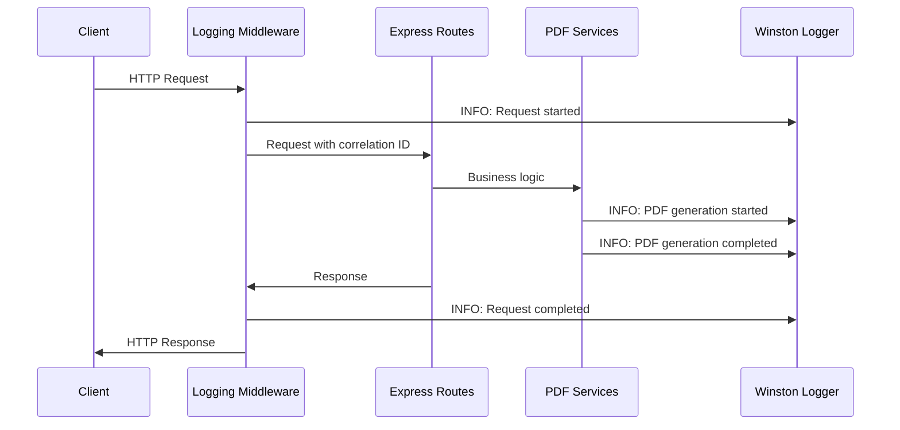

# 📄 Structured Logging Brief: Server-Side Logging System

## 🎯 **Objective**

To implement a **structured logging system** for the server that provides INFO logs for all major actions and ERROR logs for handled errors, enabling better monitoring, debugging, and operational visibility of the PDF generation service.

## 🧱 **Problem & Solution**

### **Current Problems**

| Issue | Impact |
|-------|--------|
| No structured logging | Difficult to track server operations and debug issues |
| Console.log statements scattered | Inconsistent log format and lack of context |
| No error correlation | Hard to trace errors back to specific requests |
| Missing operational visibility | No insight into PDF generation performance or failures |
| No request tracing | Cannot correlate logs across request lifecycle |

### **Solution Goals**

| Goal | Description |
|------|-------------|
| Structured JSON logging | Consistent, machine-readable log format |
| Request correlation | Unique request IDs for tracing across operations |
| Performance monitoring | Track PDF generation times and success rates |
| Error context | Detailed error information with stack traces |
| Operational metrics | Log server startup, shutdown, and health status |
| Development vs Production | Different log levels and formats per environment |

## ⚙️ **Technical Design**

### **Technology Stack**

| Technology | Purpose |
|------------|---------|
| Winston | Structured logging with multiple transports |
| Morgan | HTTP request logging middleware |
| UUID | Generate unique request IDs for correlation |
| Express | Middleware integration for request logging |
| TypeScript | Type-safe logging with proper interfaces |

### **Architecture Overview**



### **File Structure Changes**

```
server/
├── src/
│   ├── services/
│   │   ├── logger.ts (new - Winston logger service)
│   │   └── pdf-generator.ts (modified - add logging)
│   ├── middleware/
│   │   ├── logging.ts (new - request logging middleware)
│   │   └── validation.ts (modified - add error logging)
│   ├── routes/
│   │   ├── pdf.ts (modified - add structured logging)
│   │   └── health.ts (modified - add logging)
│   ├── config/
│   │   ├── development.ts (modified - add logging config)
│   │   └── production.ts (modified - add logging config)
│   └── server.ts (modified - integrate logging middleware)
└── package.json (add winston and morgan dependencies)
```

## 📋 **Requirements**

### **Core Features**

1. **Structured JSON Logging**
   - All logs in JSON format for machine readability
   - Consistent field names: timestamp, level, message, correlationId, context
   - Environment-specific log levels (DEBUG for development, INFO for production)

2. **Request Correlation**
   - Unique request ID generated for each HTTP request
   - Correlation ID passed through all service calls
   - Request lifecycle tracking (start, processing, completion)

3. **Performance Monitoring**
   - PDF generation time tracking
   - Success/failure rate logging
   - Memory usage monitoring for large PDF operations

4. **Error Context**
   - Detailed error information with stack traces
   - Error correlation with request IDs
   - Graceful error handling with proper logging

### **Logging Categories**

| Category | Level | Events |
|----------|-------|--------|
| **Server Lifecycle** | INFO | Server startup, shutdown, health checks |
| **HTTP Requests** | INFO | Request start, completion, status codes |
| **PDF Generation** | INFO | Generation start, completion, file paths |
| **Business Logic** | INFO | Resume type validation, configuration loading |
| **Errors** | ERROR | Validation failures, PDF generation errors, system errors |
| **Performance** | INFO | Generation times, memory usage, file sizes |

### **Log Format Specification**

```json
{
  "timestamp": "2024-01-15T10:30:45.123Z",
  "level": "INFO",
  "message": "PDF generation completed",
  "correlationId": "req-123e4567-e89b-12d3-a456-426614174000",
  "context": {
    "resumeType": "staff_platform_engineer",
    "generationTime": 2450,
    "fileSize": "156KB",
    "filePath": "/generated-pdfs/staff_platform_engineer_20240115.pdf"
  },
  "requestId": "req-123e4567-e89b-12d3-a456-426614174000",
  "userId": null,
  "environment": "development"
}
```

## 🖥️ **Implementation Requirements**

### **Logger Service**

| Component | Requirement |
|-----------|-------------|
| **Winston Configuration** | Multiple transports (console, file) with environment-specific settings |
| **Log Levels** | ERROR, WARN, INFO, DEBUG with proper filtering |
| **Format** | JSON format with timestamp, level, message, and context |
| **Correlation** | Request ID generation and propagation through services |
| **Performance** | Async logging to prevent blocking operations |

### **Middleware Integration**

| Component | Requirement |
|-----------|-------------|
| **Request Logging** | Morgan middleware for HTTP request/response logging |
| **Correlation ID** | Generate and inject request ID into all logs |
| **Error Handling** | Catch and log all unhandled errors with context |
| **Performance Tracking** | Request duration and response size logging |

### **Service Integration**

| Service | Logging Requirements |
|---------|---------------------|
| **PDF Generator** | Generation start/completion, file operations, error handling |
| **Validation Middleware** | Input validation results, error details |
| **Health Routes** | Health check requests and results |
| **Configuration** | Config loading and validation |

### **Environment Configuration**

| Environment | Log Level | Transports | Format |
|-------------|-----------|------------|--------|
| **Development** | DEBUG | Console, File | JSON with pretty printing |
| **Production** | INFO | File, Console (errors only) | JSON compact |
| **Testing** | ERROR | Console only | JSON compact |

### **Error Handling**

| Error Type | Log Level | Context Required |
|------------|-----------|-----------------|
| **Validation Errors** | ERROR | Request body, validation rules, field names |
| **PDF Generation Errors** | ERROR | Resume type, options, stack trace |
| **System Errors** | ERROR | Error message, stack trace, request context |
| **Configuration Errors** | ERROR | Config file, missing values, environment |

### **Performance Metrics**

| Metric | Log Level | Context |
|--------|-----------|---------|
| **PDF Generation Time** | INFO | Resume type, generation time, file size |
| **Memory Usage** | INFO | Peak memory, garbage collection events |
| **Request Duration** | INFO | Endpoint, duration, status code |
| **File Operations** | INFO | File path, operation type, success/failure |

## 🔧 **Configuration**

### **Development Environment**

```typescript
// config/development.ts
export const logging = {
  level: 'debug',
  transports: ['console', 'file'],
  format: 'json',
  file: {
    filename: 'logs/development.log',
    maxSize: '10m',
    maxFiles: 5
  },
  console: {
    colorize: true,
    prettyPrint: true
  }
};
```

### **Production Environment**

```typescript
// config/production.ts
export const logging = {
  level: 'info',
  transports: ['file', 'console'],
  format: 'json',
  file: {
    filename: 'logs/application.log',
    maxSize: '50m',
    maxFiles: 10
  },
  console: {
    level: 'error',
    colorize: false
  }
};
```

## 📊 **Monitoring & Alerting**

### **Key Metrics to Track**

| Metric | Threshold | Action |
|--------|-----------|--------|
| **PDF Generation Time** | > 30 seconds | Alert for performance degradation |
| **Error Rate** | > 5% | Alert for service issues |
| **Memory Usage** | > 80% | Alert for resource constraints |
| **Request Duration** | > 10 seconds | Alert for slow responses |

### **Log Analysis**

| Analysis | Purpose | Implementation |
|----------|---------|----------------|
| **Error Patterns** | Identify common failure modes | Log aggregation and analysis |
| **Performance Trends** | Track PDF generation performance | Time-series analysis of generation times |
| **Usage Patterns** | Understand resume type popularity | Request frequency analysis |
| **System Health** | Monitor server stability | Error rate and uptime tracking |

## 🧪 **Testing Requirements**

### **Unit Tests**

| Test Category | Coverage |
|---------------|----------|
| **Logger Service** | Winston configuration, log level filtering, correlation ID generation |
| **Middleware** | Request logging, error handling, correlation ID injection |
| **Service Integration** | PDF generator logging, validation logging, health check logging |

### **Integration Tests**

| Test Category | Coverage |
|---------------|----------|
| **Request Flow** | End-to-end request logging with correlation |
| **Error Handling** | Error propagation and logging across services |
| **Performance** | Logging performance impact on PDF generation |

### **Log Validation**

| Validation | Requirement |
|------------|-------------|
| **JSON Format** | All logs must be valid JSON |
| **Required Fields** | timestamp, level, message, correlationId |
| **Error Context** | Errors must include stack trace and request context |
| **Performance Impact** | Logging must not significantly impact PDF generation time |

## 📈 **Success Metrics**

| Metric | Target | Measurement |
|--------|--------|-------------|
| **Log Coverage** | 100% of major actions | Code coverage analysis |
| **Error Tracking** | 100% of handled errors | Error log analysis |
| **Performance Impact** | < 5% overhead | Before/after performance testing |
| **Correlation Success** | 100% request tracing | Log correlation analysis |
| **Development Experience** | Improved debugging capability | Developer feedback |

## 🚀 **Implementation Plan**

| Task | TODO | In Progress | Done | Priority |
|------|------|-------------|------|----------|
| **Phase 1: Core Logging Infrastructure** | | | ✅ | |
| Set up Winston logger with basic configuration | | | ✅ | High |
| Implement request correlation middleware | | | ✅ | High |
| Add basic logging to server startup/shutdown | | | ✅ | High |
| Configure environment-specific log levels | | | ✅ | High |
| **Phase 2: Service Integration** | | | | |
| Integrate logging into PDF generator service | ✅ | | | High |
| Add logging to validation middleware | ✅ | | | High |
| Implement error handling with structured logging | ✅ | | | High |
| Add logging to health check routes | ✅ | | | Medium |
| **Phase 3: Performance & Monitoring** | | | | |
| Add performance metrics logging | ✅ | | | Medium |
| Implement log rotation and management | ✅ | | | Medium |
| Set up monitoring and alerting thresholds | ✅ | | | Low |
| Add memory usage monitoring | ✅ | | | Medium |
| **Phase 4: Testing & Validation** | | | | |
| Comprehensive test coverage for logging | ✅ | | | High |
| Performance impact validation | ✅ | | | Medium |
| Log format and correlation validation | ✅ | | | Medium |
| Integration tests for request flow | ✅ | | | High |
| **Phase 5: Documentation & Deployment** | | | | |
| Update API documentation with logging info | ✅ | | | Low |
| Create logging configuration guide | ✅ | | | Medium |
| Set up log aggregation for production | ✅ | | | Low |
| Performance benchmarking and optimization | ✅ | | | Medium |
