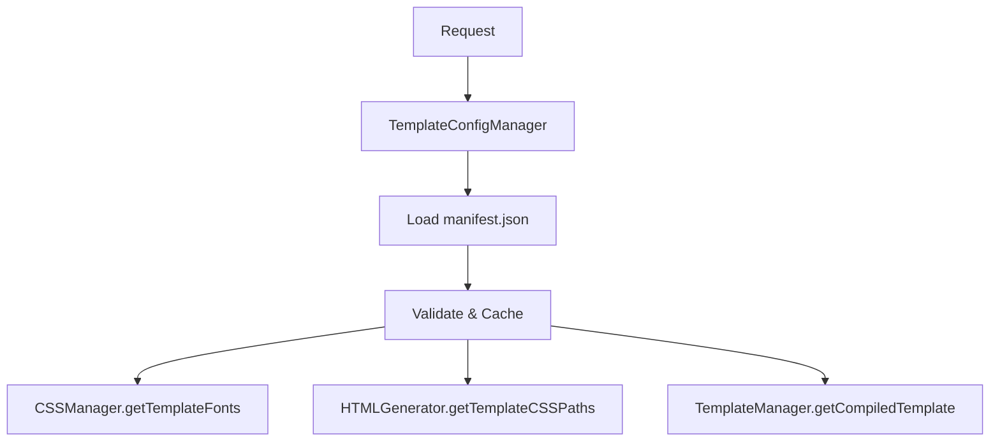
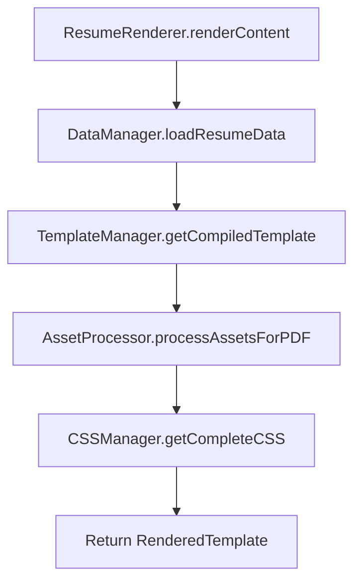
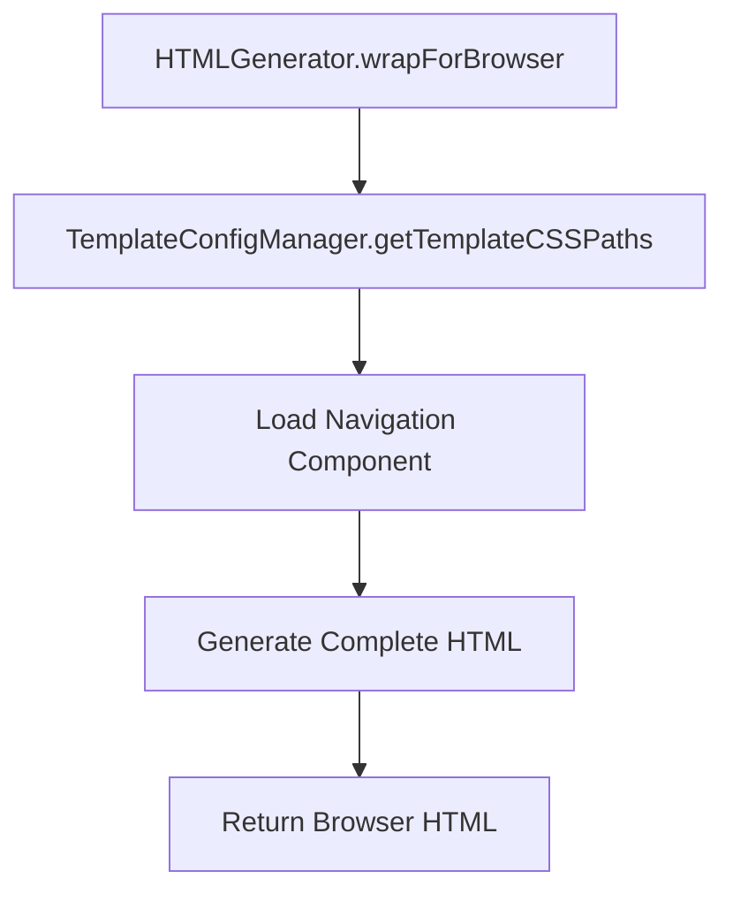

# 🏗️ Template Engine Refactoring Plan

## 🎯 **Objective**

Refactor the overloaded `UnifiedTemplateEngine` (597 lines, 15+ methods) into focused, single-responsibility services with `TemplateConfigManager` as the central configuration hub.

## 🧱 **Current State Analysis**

### **UnifiedTemplateEngine Responsibilities (Overloaded)**

| Responsibility | Methods | Lines | Problem |
|---------------|---------|-------|---------|
| **Data Loading** | `loadResumeData()`, `loadHeader()`, `loadStyling()`, `loadResumeJsonData()`, `loadAllMarkdown()` | ~150 | Should be separate service |
| **Template Management** | `getCompiledTemplate()`, `loadComponentTemplate()`, `preloadComponents()`, `getComponentTemplate()` | ~100 | Template compilation concern |
| **Content Rendering** | `renderContent()`, `renderResume()`, `renderTemplate()` | ~50 | Orchestration concern |
| **Asset Processing** | `processAssetsForPDF()`, `getIconHTMLSync()` | ~30 | Asset handling concern |
| **HTML Generation** | `createCompleteHTML()` | ~25 | HTML generation concern |
| **Template Discovery** | `getAvailableResumeTypes()`, `getAvailableTemplates()` | ~40 | Discovery concern |
| **Helper Registration** | `configureMarked()`, `registerHelpers()` | ~100 | Template engine concern |
| **Cache Management** | `clearCache()`, `getCacheStats()` | ~10 | Utility concern |

### **Problems with Current Architecture**

1. **Single Responsibility Principle Violation** - 8 different concerns in one class
2. **High Complexity** - 597 lines, difficult to maintain
3. **Tight Coupling** - Direct dependencies on multiple managers
4. **Interface Segregation Violation** - Clients forced to depend on entire interface
5. **Hard to Test** - Can't test individual components in isolation
6. **Hard to Extend** - Changes affect entire class

---

## 🎯 **Proposed Architecture**

### **Core Principles**

1. **TemplateConfigManager** = Single source of truth for template configuration
2. **Single Responsibility** = Each service has one clear purpose
3. **Composition over Inheritance** = Services compose together
4. **Interface Segregation** = Clients only depend on what they need
5. **Dependency Injection** = Services inject what they need

### **Service Structure**

```
server/src/services/
├── template-config-manager.ts     # ✅ Central configuration hub
├── data-manager.ts               # 🔄 Data loading & processing
├── template-manager.ts           # 🔄 Template compilation & management
├── asset-processor.ts            # 🔄 Asset processing & embedding
├── resume-renderer.ts            # 🔄 Content rendering orchestration
├── html-generator.ts             # 🔄 HTML document generation
├── css-manager.ts                # 🔄 Enhanced with TemplateConfigManager
└── content-wrapper.ts            # 🔄 Simplified wrapper
```

---

## 📋 **Detailed Service Specifications**

### **1. TemplateConfigManager** ✅ **COMPLETED**

**Purpose**: Central configuration hub for all template-related configuration

```typescript
class TemplateConfigManager {
  // Template Configuration
  getTemplateManifest(templateName: string): Promise<TemplateManifest>
  getTemplateCSSPaths(templateName: string): Promise<CSSPaths>
  getTemplateFonts(templateName: string): Promise<FontConfig[]>

  // Template Discovery
  getAvailableTemplates(): Promise<string[]>
  validateTemplateExists(templateName: string): Promise<boolean>

  // Template Validation
  validateManifest(manifest: any, templateName: string): void

  // Caching
  clearCache(): void
  getCacheStats(): CacheStats
}
```

**Responsibilities**:
- Load and validate template manifests
- Provide CSS paths for templates
- Provide font configurations for templates
- Discover available templates
- Cache template configurations
- Validate manifest structure

### **2. DataManager** 🔄 **NEW**

**Purpose**: Handle all data loading and processing operations

```typescript
class DataManager {
  // Resume Data Loading
  loadResumeData(resumeType: string, context: TemplateContext): Promise<ResumeData>
  loadHeader(): Promise<HeaderData>
  loadStyling(): Promise<StylingData>
  loadResumeJsonData(resumeType: string): Promise<ResumeJsonData>

  // Markdown Processing
  loadAllMarkdown(resumeType: string): Promise<Map<string, string>>
  processMarkdownContent(data: any, markdown: Map<string, string>, context: TemplateContext): Promise<any>

  // Resume Discovery
  getAvailableResumeTypes(): Promise<string[]>
}
```

**Responsibilities**:
- Load resume JSON data
- Load shared header and styling data
- Load and process markdown files
- Discover available resume types
- Process markdown content for PDF/browser contexts

**Extracted from**: `UnifiedTemplateEngine.loadResumeData()`, `loadHeader()`, `loadStyling()`, `loadResumeJsonData()`, `loadAllMarkdown()`, `processMarkdownContent()`, `getAvailableResumeTypes()`

### **3. TemplateManager** 🔄 **NEW**

**Purpose**: Handle template compilation, component management, and helper registration

```typescript
class TemplateManager {
  constructor(private templateConfig: TemplateConfigManager) {}

  // Template Compilation
  getCompiledTemplate(templateName: string): Promise<HandlebarsTemplateDelegate>
  compileTemplate(templateContent: string): HandlebarsTemplateDelegate

  // Component Management
  loadComponentTemplate(componentName: string, templateName: string): Promise<string>
  preloadComponents(templateName: string): Promise<void>
  getComponentTemplate(componentKey: string): string | undefined

  // Helper Registration
  registerHelpers(): void
  configureMarked(): void

  // Caching
  clearCache(): void
  getCacheStats(): CacheStats
}
```

**Responsibilities**:
- Compile Handlebars templates
- Manage component templates
- Register Handlebars helpers
- Configure markdown processing
- Cache compiled templates
- Preload components for synchronous rendering

**Extracted from**: `UnifiedTemplateEngine.getCompiledTemplate()`, `loadComponentTemplate()`, `preloadComponents()`, `getComponentTemplate()`, `registerHelpers()`, `configureMarked()`, `clearCache()`, `getCacheStats()`

### **4. AssetProcessor** 🔄 **NEW**

**Purpose**: Handle asset processing, embedding, and PDF optimization

```typescript
class AssetProcessor {
  // PDF Asset Processing
  processAssetsForPDF(data: any): Promise<void>
  embedImageAsBase64(imagePath: string): Promise<string | null>

  // Font Processing
  embedFontsAsBase64(fonts: FontConfig[]): Promise<string>

  // Icon Processing
  getIconHTMLSync(iconType: string): string
  embedIconsAsBase64(): Promise<string>
}
```

**Responsibilities**:
- Process assets for PDF generation
- Embed images as base64 for PDF
- Embed fonts as base64 for PDF
- Generate icon HTML
- Embed icons as base64 for PDF

**Extracted from**: `UnifiedTemplateEngine.processAssetsForPDF()`, `getIconHTMLSync()`

### **5. ResumeRenderer** 🔄 **NEW**

**Purpose**: Orchestrate content rendering process

```typescript
class ResumeRenderer {
  constructor(
    private dataManager: DataManager,
    private templateManager: TemplateManager,
    private assetProcessor: AssetProcessor,
    private cssManager: CSSManager
  ) {}

  // Content Rendering
  renderContent(resumeType: string, templateName: string, context: TemplateContext): Promise<RenderedTemplate>
  renderResume(resumeType: string, templateName: string, context: TemplateContext): Promise<RenderedTemplate>
  renderTemplate(templateName: string, data: ResumeData): Promise<string>
}
```

**Responsibilities**:
- Orchestrate the complete rendering process
- Coordinate between data loading, template compilation, and asset processing
- Generate pure content without HTML wrapper
- Generate complete resume with HTML wrapper

**Extracted from**: `UnifiedTemplateEngine.renderContent()`, `renderResume()`, `renderTemplate()`

### **6. HTMLGenerator** 🔄 **NEW**

**Purpose**: Generate complete HTML documents for different contexts

```typescript
class HTMLGenerator {
  constructor(private templateConfig: TemplateConfigManager) {}

  // HTML Generation
  createCompleteHTML(htmlContent: string, css: string, templateName: string): Promise<string>
  wrapForBrowser(content: RenderedTemplate): Promise<string>
  wrapForPDF(content: RenderedTemplate): Promise<string>

  // Navigation
  loadNavigationComponent(): Promise<string>
}
```

**Responsibilities**:
- Generate complete HTML documents
- Wrap content for browser rendering (with navigation)
- Wrap content for PDF rendering (without navigation)
- Load navigation components
- Use template configuration for CSS paths

**Extracted from**: `UnifiedTemplateEngine.createCompleteHTML()`, `ContentWrapper.wrapForBrowser()`, `wrapForPDF()`, `loadNavigationComponent()`

### **7. CSSManager** 🔄 **ENHANCED**

**Purpose**: Enhanced CSS management with TemplateConfigManager integration

```typescript
class CSSManager {
  constructor(private templateConfig: TemplateConfigManager) {}

  // CSS Assembly
  getCompleteCSS(context: CSSContext): Promise<string>
  assembleCSS(context: CSSContext): Promise<CSSAssembly>

  // Font CSS
  loadPDFFontCSS(templateName: string): Promise<string> // Uses TemplateConfigManager
  loadFontCSS(): Promise<string>

  // Template CSS
  loadTemplateCSS(templateName: string): Promise<string>
  loadBaseCSS(): Promise<string>
  loadIconCSS(): Promise<string>
}
```

**Responsibilities**:
- Assemble complete CSS for different contexts
- Load template-specific CSS
- Load font CSS (browser and PDF)
- Load icon CSS
- Use TemplateConfigManager for font configuration

**Enhanced**: Integrate with `TemplateConfigManager.getTemplateFonts()` instead of loading fonts.json directly

### **8. ContentWrapper** 🔄 **SIMPLIFIED**

**Purpose**: Simplified wrapper that delegates to HTMLGenerator

```typescript
class ContentWrapper {
  constructor(private htmlGenerator: HTMLGenerator) {}

  // Delegation methods
  wrapForBrowser(content: RenderedTemplate): Promise<string>
  wrapForPDF(content: RenderedTemplate): Promise<string>
}
```

**Responsibilities**:
- Provide backward-compatible interface
- Delegate to HTMLGenerator for actual HTML generation
- Remove manifest loading (moved to TemplateConfigManager)

---

## 🔄 **Data Flow Architecture**

### **Template Configuration Flow**


### **Content Rendering Flow**


### **HTML Generation Flow**


---

## 🚀 **Migration Strategy**

### **Phase 1: TemplateConfigManager** ✅ **COMPLETED**
- ✅ Created `TemplateConfigManager`
- ✅ Moved manifest loading and validation
- ✅ Added caching and discovery methods
- ✅ Updated CSSManager to use TemplateConfigManager
- ✅ Updated ContentWrapper to use TemplateConfigManager

### **Phase 2: Extract DataManager** ✅ **COMPLETED**
```typescript
// Extract from UnifiedTemplateEngine:
- loadResumeData()
- loadHeader()
- loadStyling()
- loadResumeJsonData()
- loadAllMarkdown()
- processMarkdownContent()
- getAvailableResumeTypes()
```

**Implementation Steps**:
1. ✅ Create `DataManager` class
2. ✅ Move data loading methods from `UnifiedTemplateEngine`
3. ✅ Update `UnifiedTemplateEngine` to use `DataManager`
4. ✅ Test data loading functionality
5. ✅ Remove data loading methods from `UnifiedTemplateEngine`

### **Phase 3: Extract TemplateManager** ✅ **COMPLETED**
```typescript
// Extract from UnifiedTemplateEngine:
- getCompiledTemplate()
- loadComponentTemplate()
- preloadComponents()
- getComponentTemplate()
- registerHelpers()
- configureMarked()
```

**Implementation Steps**:
1. ✅ Create `TemplateManager` class with `TemplateConfigManager` dependency
2. ✅ Move template compilation methods from `UnifiedTemplateEngine`
3. ✅ Move helper registration methods from `UnifiedTemplateEngine`
4. ✅ Update `UnifiedTemplateEngine` to use `TemplateManager`
5. ✅ Test template compilation functionality
6. ✅ Remove template compilation methods from `UnifiedTemplateEngine`

### **Phase 4: Extract AssetProcessor** ✅ **COMPLETED**
```typescript
// Extracted from UnifiedTemplateEngine:
- processAssetsForPDF()
- getIconHTMLSync()
// Extracted from DataManager:
- embedImageAsBase64()
// Extracted from CSSManager:
- embedFontsAsBase64()
// New methods:
- embedIconsAsBase64()
```

**Implementation Steps**:
1. ✅ Create `AssetProcessor` class
2. ✅ Move asset processing methods from `UnifiedTemplateEngine`
3. ✅ Move image embedding from `DataManager`
4. ✅ Move font embedding from `CSSManager`
5. ✅ Update `UnifiedTemplateEngine` to use `AssetProcessor`
6. ✅ Update `TemplateManager` to use `AssetProcessor` for icons
7. ✅ Update `DataManager` to use `AssetProcessor` for images
8. ✅ Update `CSSManager` to use `AssetProcessor` for fonts
9. ✅ Test asset processing functionality
10. ✅ Remove asset processing methods from other services

**Benefits Achieved**:
- **Centralized Asset Processing**: All asset processing logic now in one service
- **Improved PDF Generation**: Better font and icon embedding for PDFs
- **Reduced Code Duplication**: Eliminated duplicate asset processing code
- **Better Error Handling**: Centralized error handling for asset operations
- **Enhanced Caching**: Asset-specific caching with statistics
- **Cleaner Service Boundaries**: Each service now has clearer responsibilities

### **Phase 5: Extract ResumeRenderer** ✅ **COMPLETED**
```typescript
// Extracted from UnifiedTemplateEngine:
- renderContent()
- renderResume()
- renderTemplate()
- createCompleteHTML()
// New orchestration methods:
- renderContent() - Pure content rendering
- renderResume() - Complete resume rendering
- renderTemplate() - Template rendering
- createCompleteHTML() - HTML document generation
```

**Implementation Steps**:
1. ✅ Create `ResumeRenderer` class with dependencies
2. ✅ Move rendering orchestration from `UnifiedTemplateEngine`
3. ✅ Update `UnifiedTemplateEngine` to delegate to `ResumeRenderer`
4. ✅ Test rendering functionality
5. ✅ Remove rendering methods from `UnifiedTemplateEngine`

**Benefits Achieved**:
- **Proper Service Composition**: ResumeRenderer orchestrates all rendering dependencies
- **Clear Separation of Concerns**: Rendering logic separated from template engine
- **Improved Maintainability**: Rendering pipeline is now centralized
- **Better Error Handling**: Centralized error handling for rendering process
- **Enhanced Caching**: Unified caching across all rendering components
- **Backward Compatibility**: UnifiedTemplateEngine maintains same interface

### **Phase 6: Extract HTMLGenerator** ✅ **COMPLETED**
```typescript
// Extracted from ResumeRenderer:
- createCompleteHTML()
// Extracted from ContentWrapper:
- wrapForBrowser()
- wrapForPDF()
- loadNavigationComponent()
// New consolidated methods:
- createCompleteHTML() - Basic HTML document generation
- wrapForBrowser() - Browser rendering with navigation
- wrapForPDF() - PDF rendering with embedded CSS
```

**Implementation Steps**:
1. ✅ Create `HTMLGenerator` class with `TemplateConfigManager` dependency
2. ✅ Move HTML generation methods from `ResumeRenderer`
3. ✅ Move HTML wrapping methods from `ContentWrapper`
4. ✅ Update `ContentWrapper` to delegate to `HTMLGenerator`
5. ✅ Update `ResumeRenderer` to use `HTMLGenerator`
6. ✅ Remove Tailwind CSS dependency from HTML generation
7. ✅ Test HTML generation functionality
8. ✅ Remove HTML generation methods from other services

**Benefits Achieved**:
- **Centralized HTML Generation**: All HTML generation logic in one service
- **Removed Tailwind Dependency**: No longer depends on external Tailwind CSS
- **Improved CSS Handling**: Proper CSS embedding for different contexts
- **Better Navigation Support**: Centralized navigation component loading
- **Cleaner Service Boundaries**: Each service has clearer responsibilities
- **Enhanced Maintainability**: HTML generation logic is now centralized

### **Phase 7: Enhance CSSManager** 🔄 **READY**
```typescript
// Update CSSManager to use TemplateConfigManager:
- loadPDFFontCSS() // Use templateConfig.getTemplateFonts()
```

**Implementation Steps**:
1. Update `CSSManager` constructor to accept `TemplateConfigManager`
2. Update `loadPDFFontCSS()` to use `TemplateConfigManager.getTemplateFonts()`
3. Remove direct manifest loading from `CSSManager`
4. Test CSS generation functionality

### **Phase 8: Simplify ContentWrapper** 🔄 **READY**
```typescript
// ContentWrapper becomes thin wrapper around HTMLGenerator
- Remove manifest loading (moved to TemplateConfigManager)
- Delegate to HTMLGenerator
```

**Implementation Steps**:
1. Update `ContentWrapper` to accept `HTMLGenerator` dependency
2. Remove manifest loading from `ContentWrapper`
3. Delegate all HTML generation to `HTMLGenerator`
4. Test HTML wrapping functionality
5. Remove manifest-related code from `ContentWrapper`

### **Phase 9: Cleanup UnifiedTemplateEngine** 🔄 **READY**
```typescript
// UnifiedTemplateEngine becomes thin orchestration layer
- Remove all extracted methods
- Keep only orchestration logic
- Update to use new services
```

**Implementation Steps**:
1. Remove all extracted methods from `UnifiedTemplateEngine`
2. Update `UnifiedTemplateEngine` to orchestrate new services
3. Test complete rendering functionality
4. Verify backward compatibility

---

## 🏗️ **Integration Points**

### **Updated Server Routes**
```typescript
// server.ts
const templateConfig = TemplateConfigManager.getInstance();
const dataManager = new DataManager();
const templateManager = new TemplateManager(templateConfig);
const assetProcessor = new AssetProcessor();
const cssManager = new CSSManager(templateConfig);
const resumeRenderer = new ResumeRenderer(dataManager, templateManager, assetProcessor, cssManager);
const htmlGenerator = new HTMLGenerator(templateConfig);
const contentWrapper = new ContentWrapper(htmlGenerator);
```

### **Updated PDF Generator**
```typescript
// pdf-generator.ts
const resumeRenderer = new ResumeRenderer(dataManager, templateManager, assetProcessor, cssManager);
const htmlGenerator = new HTMLGenerator(templateConfig);
```

### **Updated Routes**
```typescript
// routes/render.ts
const resumeRenderer = new ResumeRenderer(dataManager, templateManager, assetProcessor, cssManager);
const contentWrapper = new ContentWrapper(htmlGenerator);
```

---

## ✅ **Benefits of Refactored Architecture**

### **1. Single Responsibility**
- Each service has one clear purpose
- Easy to understand and maintain
- Changes isolated to specific services

### **2. TemplateConfigManager as Hub**
- Centralized template configuration
- Single source of truth for manifests
- Shared caching across all consumers

### **3. Dependency Injection**
- Services inject what they need
- Easy to test with mocks
- Loose coupling between services

### **4. Interface Segregation**
- Clients only depend on what they need
- No forced dependencies on entire UnifiedTemplateEngine
- Clean, focused interfaces

### **5. Extensibility**
- Easy to add new template properties
- Easy to add new rendering contexts
- Easy to add new asset types

### **6. Testability**
- Each service can be tested independently
- Clear interfaces for mocking
- Isolated unit tests

### **7. Performance**
- Shared caching across services
- Reduced duplicate file reads
- Efficient memory usage

### **8. Maintainability**
- Clear separation of concerns
- Easy to locate and fix issues
- Reduced cognitive load

---

## 🚀 **Implementation Priority**

| Phase | Service | Priority | Status |
|-------|---------|----------|--------|
| 1 | TemplateConfigManager | ✅ | **COMPLETED** |
| 2 | DataManager | ✅ | **COMPLETED** |
| 3 | TemplateManager | ✅ | **COMPLETED** |
| 4 | AssetProcessor | ✅ | **COMPLETED** |
| 5 | ResumeRenderer | ✅ | **COMPLETED** |
| 6 | HTMLGenerator | ✅ | **COMPLETED** |
| 7 | Enhanced CSSManager | 🔥 High | **READY** |
| 8 | Simplified ContentWrapper | 🔶 Medium | **READY** |
| 9 | Cleanup UnifiedTemplateEngine | 🔷 Low | **READY** |

**Total Progress**: 6/9 phases completed (66.7%)

---

## 🧪 **Testing Strategy**

### **Unit Tests**
- Test each service in isolation
- Mock dependencies for clean tests
- Test error conditions and edge cases

### **Integration Tests**
- Test service composition
- Test complete rendering flow
- Test backward compatibility

### **Performance Tests**
- Test caching effectiveness
- Test memory usage
- Test rendering performance

---

## 📋 **Success Criteria**

1. **Single Responsibility**: Each service has one clear purpose
2. **Backward Compatibility**: Existing functionality works unchanged
3. **Performance**: No degradation in rendering performance
4. **Testability**: All services can be tested independently
5. **Maintainability**: Easy to understand and modify
6. **Extensibility**: Easy to add new features

---

## 🎯 **Next Steps**

1. **Authorize Phase 2**: Extract DataManager
2. **Authorize Phase 3**: Extract TemplateManager
3. **Authorize Phase 4**: Extract AssetProcessor
4. **Authorize Phase 5**: Extract ResumeRenderer
5. **Authorize Phase 6**: Extract HTMLGenerator
6. **Authorize Phase 7**: Enhance CSSManager
7. **Authorize Phase 8**: Simplify ContentWrapper
8. **Authorize Phase 9**: Cleanup UnifiedTemplateEngine

This refactored architecture provides a clean separation of concerns while maintaining the `TemplateConfigManager` as the central configuration hub. Each service has a single, clear responsibility, making the codebase much more maintainable and testable.
